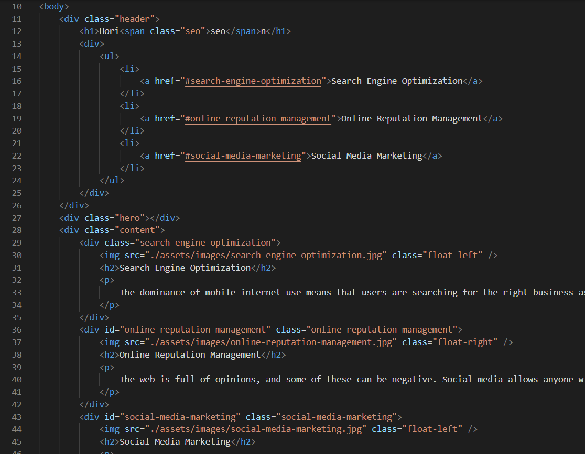
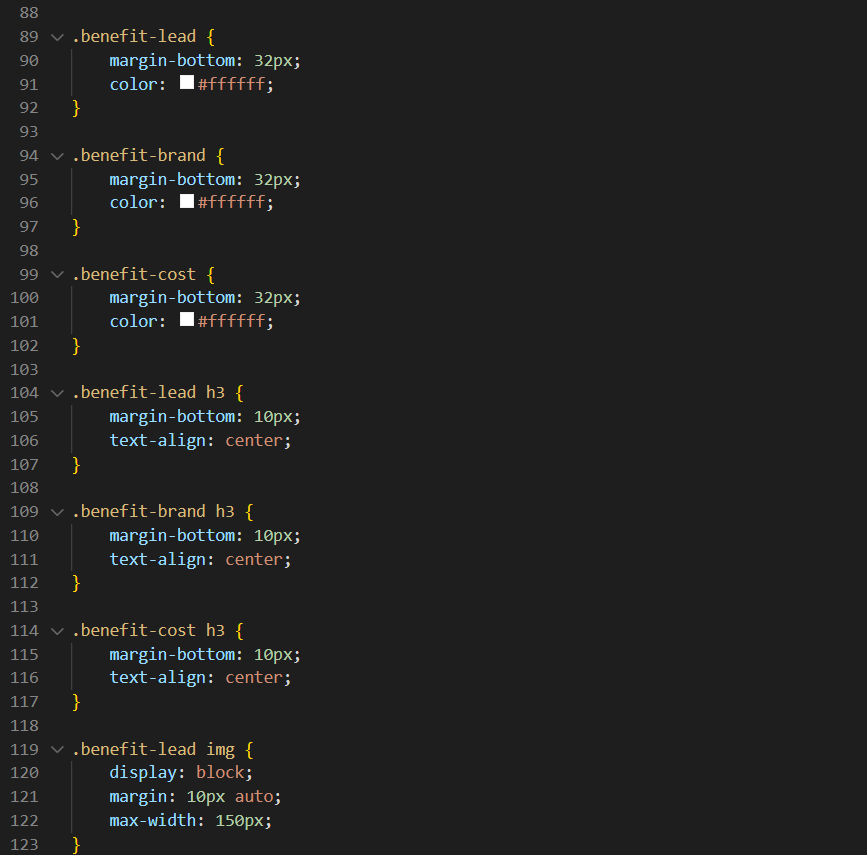

# accessibility-refactor

## Description

This project is part of a refactoring challenge for UW web developpement Bootcamp. The goal of the excercise was to modify the html and css code to be more accessible and cleaner. removing redudant code and adding comments.

## Installation

N/A

## Usage

Here are a few examples of the things that needed to be changed:

Only non-Semantic Elements were used and needed to be replaced by Semantic Elements.

Too many lines of repetetive code needed to be refactored.

## Credits

N/A

## License

The last section of a high-quality README file is the license. This lets other developers know what they can and cannot do with your project. If you need help choosing a license, refer to [https://choosealicense.com/](https://choosealicense.com/).

---
